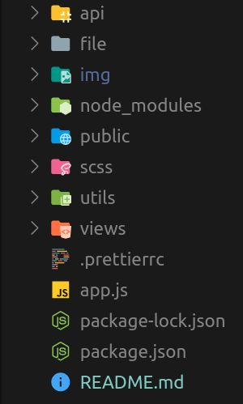
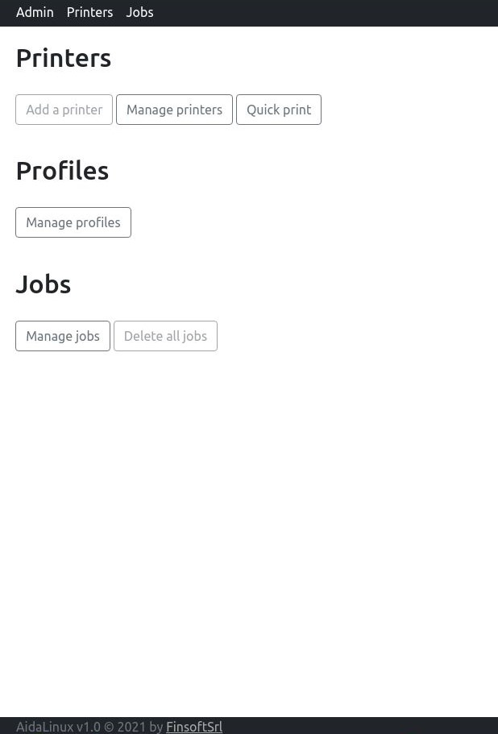
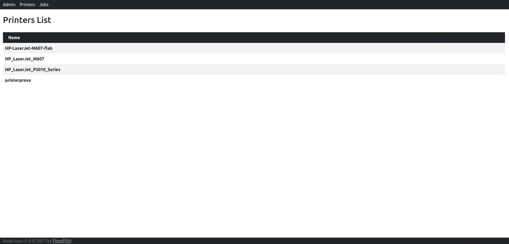
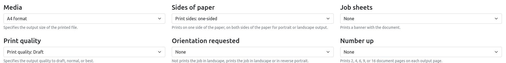
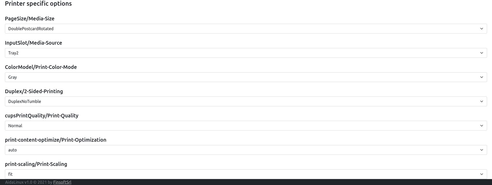
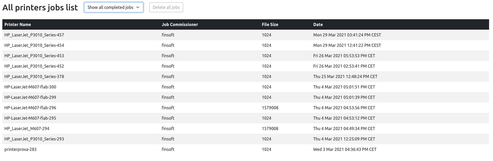
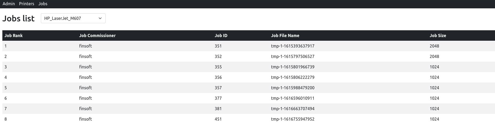

# Aida Linux / Progetto Manager Stampanti
## Struttura Progetto
   

  
## Utilizzo dell'applicativo

Il sito si presenta con una schermata di ingresso all'utente, strutturata in base ai contenuti:
- Stampanti 
- Profili
  - *Stili di stampaggio creati dall' utente*
- 'Jobs'
   - *I lavori di stampa assegnati alle stampanti* 
- Stampa

  

 ___

 ### Stampanti 
  

 in questa schermata sara' possibile controllare gli status delle stampanti connesse allo stesso network del proprio PC, cliccando sopra alla stampante desiderata, si aprira una pagina di dettaglio con tutte le informazioni necessarie

  

___

 ### Profili

  

 La schermata del profili e' divisa in 3 parti:

 1. Impostazione del profilo
    - Comprende la scelta del nome del profilo e la scelta della stampante sul quale applicare le opzioni sotto riportate.
 2. Opzioni di stampa Generali
    
     
    - Comprendono le opzioni piu' comuni e generalmente compatibili con qualsiasi stampante
  
 3. Opzioni di stampa Specifiche.

    
    - Queste opzioni cambiano a seconda della stampante e dei driver a lei annessi, sono opzioni piu' specifiche e personalizzabili.

> e' possibile modificare un profilo gia' esistente, bastera inserire lo stesso nome del profilo gia' esistente e salvare le modifiche apportate

___

### Jobs

La schermata dei Jobs e' composta da due tabelle:

1. Tabella contenente tutti i Jobs di tutte le stampanti

    
    - Potrai anche scegliere se visualizzare i jobs completati o no, tramite una tendina a scelta
2. Tabella contenente i jobs *solo* delle stampante selezionata
   
   
   

___

### Come stampare

- Per mandare in stampa un documento, bastera andare nella sezione **"Quick Print"**, entrando nella schermata, simile alla finestra vista in precedenza, potrete segliere i vostri dettagli di stampa o scegliere un profilo di stampa precedente creato
     > i dettagli del vostro profilo verranno automaticamente inseriti all'interno del form di stampa

- scegliere dal file browser il file da mandare in stampa, e cliccare su *'Print'*

